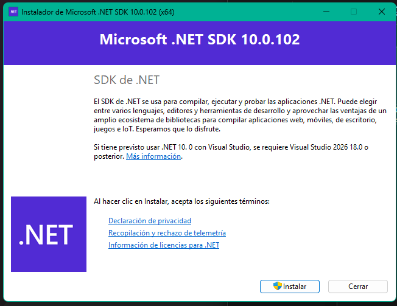

# Tutorial básico: Uso de C# con Visual Studio Code en Windows

Este tutorial describe los pasos necesarios para instalar el entorno de desarrollo y comenzar a trabajar con C# utilizando Visual Studio Code en Windows, desde la instalación del SDK hasta la ejecución de un proyecto de consola.

## Instalación del SDK de .NET y Entorno de Desarrollo en Windows

### 1. Instalador de .NET SDK

**¿Qué es?**

El .NET SDK (Software Development Kit) es un conjunto de herramientas que permite desarrollar aplicaciones en C# y otros lenguajes compatibles con la plataforma .NET. Incluye el compilador, bibliotecas base y utilidades de línea de comandos necesarias para crear, compilar y ejecutar proyectos.

**¿Para qué nos sirve?**

El SDK de .NET se utiliza para:

- Crear proyectos en C#.
- Compilar código fuente.
- Ejecutar aplicaciones desde la terminal.
- Utilizar comandos como `dotnet new`, `dotnet build` y `dotnet run`.

**Enlace de descarga:**

[Download .NET (Linux, macOS, and Windows) | .NET](https://dotnet.microsoft.com/en-us/download)

### 2. Ejecutar el Instalador

1. Abrir el instalador descargado.
2. Presionar el botón **Instalar**.
3. Esperar a que finalice el proceso de instalación (se requieren permisos de administrador).




### 3. Verificar la Instalación

Abrir una terminal (CMD o PowerShell) y ejecutar el siguiente comando:

```bash
dotnet --version
```

Si la instalación fue correcta, se mostrará la versión del SDK instalado.


## Creación de un Proyecto en C# con Visual Studio Code

### 4. Crear una Carpeta para el Proyecto

En Visual Studio Code, crear una carpeta para organizar el proyecto y abrirla como carpeta de trabajo.


### 5. Crear un Nuevo Proyecto de Consola

Desde la terminal integrada de Visual Studio Code (o una terminal del sistema), acceder a la carpeta creada y ejecutar:

```bash
dotnet new console -o <NombreDelProyecto>
```

Este comando crea una nueva carpeta que contiene un proyecto de tipo consola en C# con la estructura básica de archivos.


### 6. Acceder al Proyecto y Ejecutarlo

Ingresar a la carpeta del proyecto:

```bash
cd <NombreDelProyecto>
```

Luego ejecutar:

```bash
dotnet run
```

Este comando:

- Compila el código fuente.
- Ejecuta la aplicación de consola.
- Muestra la salida del programa en la terminal.


## Estructura de Carpetas Generadas

Al crear y compilar un proyecto, se generan varias carpetas importantes:

- **bin**
    
    Contiene los archivos compilados de la aplicación, incluyendo el ejecutable y las dependencias necesarias para su ejecución.
    
- **obj**
    
    Contiene archivos temporales y metadatos generados durante el proceso de compilación. Estos archivos son utilizados internamente por el sistema de compilación de .NET.
    

## Recomendaciones

- Instalar la extensión oficial de **C#** en Visual Studio Code.
    
    Esta extensión proporciona:
    
    - Resaltado de sintaxis.
    - Autocompletado de código.
    - Depuración.
    - Integración con el SDK de .NET.
- Si al instalar el SDK se muestra la versión correctamente en CMD, pero la terminal no reconoce el comando `dotnet`, verificar que la ruta de instalación de .NET se encuentre en las variables de entorno (PATH).
    
    Normalmente la ruta es:
    
    ```
    C:\Program Files\dotnet\
    ```
    
    Si la ruta no está en el PATH:
    
    - Agregarla manualmente.
    - Reiniciar el equipo o cerrar y volver a abrir la terminal.